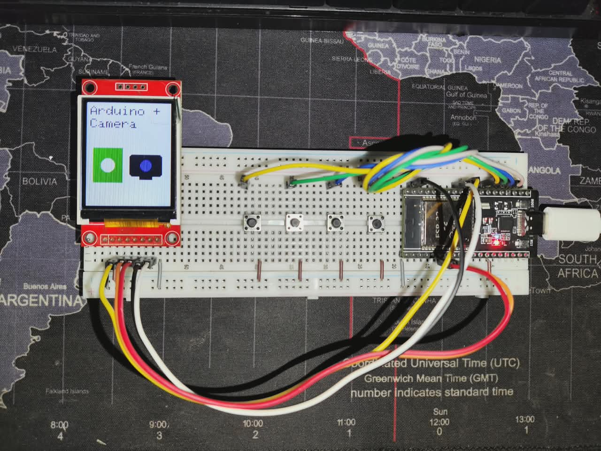

# ESP32 OBS Stream Deck

A physical controller (Stream Deck) built with an ESP32 and an ST7735 display (128x160) to control OBS Studio scenes via WebSockets.

## Features

- Native integration with OBS Studio via the WebSocket v5 protocol.
- Custom graphical interface on the display (drawn with Adafruit GFX).
- Instant scene switching using physical push-buttons.
- "Plug & Play" project structure compatible with both **PlatformIO** and **Arduino IDE**.

## Hardware Requirements

- 1x ESP32 Board.
- 1x TFT Display ST7735 (128x160 resolution).
- 4x Push-Buttons.
- Jumper wires.

## Wiring (Pinout)

| Component | ESP32 Pin |
| :--- | :--- |
| **Button 1 (PC Camera)** | 15 |
| **Button 3 (Arduino IDE)** | 0 |
| **Button 4 (PC + Arduino)** | 4 |
| **Display CS** | 5 |
| **Display RST** | 33 |
| **Display DC (A0)** | 32 |
| **Display MOSI (SDA)** | 23 |
| **Display SCLK (SCK)** | 18 |

## How to Add More Buttons and Scenes

The code is designed to scale easily. If you want to add a 5th, 6th, or more buttons, simply open `esp32_stream_deck.ino` and locate the `CONFIGURATION FOR BUTTONS AND SCENES` section at the top.

1. Increase the `NUM_BUTTONS` constant.
2. Add your new ESP32 pin to the `buttonPins` array.
3. Add the exact OBS Scene name to the `SCENES` array.

*(Note: If you add a new scene, the display will automatically generate a generic placeholder icon with the scene's name).*

## How to Set Up the Project

### 1. Configure Credentials (Wi-Fi and OBS)

Sensitive network information is not stored in the main code. It uses a separate configuration file.

1. Make a copy of the `secrets.example.h` file and rename it to `secrets.h`.
2. Edit `secrets.h` and enter your Wi-Fi network's SSID and password, along with the local IP address of the computer running OBS Studio.

### 2. Configure OBS Studio

1. In OBS, go to the top menu: **Tools -> WebSocket Server Settings**.
2. Check the box **Enable WebSocket server**.
3. The default port is `4455` (this is already configured in the code).
4. For this basic version of the project, **uncheck** the "Enable authentication" option (or implement SHA256 password hashing in the ESP32 code later).

### 3. How to Compile (Choose an option)

#### Option A: Arduino IDE

1. Make sure you have the ESP32 board package installed in your Arduino IDE.
2. Open the **Library Manager** and install the following libraries:
   - `ArduinoJson` (by bblanchon)
   - `ArduinoWebsockets` (by gilmaimon)
   - `Adafruit ST7735 and ST7789 Library`
   - `Adafruit GFX Library`
3. Enter the project folder and double-click the `esp32_stream_deck.ino` file.
4. Select your board, the correct COM port, compile, and upload!

#### Option B: PlatformIO (VS Code)

1. Open the root folder of this repository in VS Code using the PlatformIO extension.
2. All libraries listed in `platformio.ini` will be downloaded automatically.
3. Click the "Upload" button on the bottom blue bar.

## Libraries Used

- [ArduinoJson](https://arduinojson.org/)
- [ArduinoWebsockets](https://github.com/gilmaimon/ArduinoWebsockets)
- [Adafruit ST7735](https://github.com/adafruit/Adafruit-ST7735-Library)
- [Adafruit GFX](https://github.com/adafruit/Adafruit-GFX-Library)
